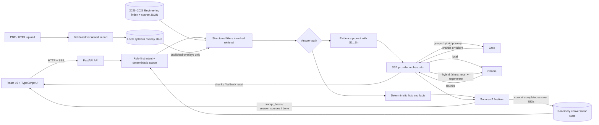

# Course Advisor

[简体中文](README.zh-CN.md)

An evidence-grounded, self-hosted course advisor for the **Columbia Engineering 2025–2026 Bulletin**.

Course Advisor combines structured catalog retrieval, deterministic fact rendering, and optional language models in a React 19 + TypeScript + FastAPI application. It is designed to make every completed answer inspectable: the UI distinguishes the courses considered during generation from the exact course records cited by the final answer.

> **Scope:** this repository contains a static Columbia Engineering Bulletin snapshot. It is not the university-wide Columbia catalog, not a real-time registrar feed, not an official Columbia product, and not a substitute for an academic advisor.

## Why this project is different

- **Structured retrieval before generation.** A rule-first intent layer filters and ranks typed catalog fields, then loads only the relevant full course records.
- **Deterministic facts where possible.** Lists, schedules, points, instructors, enrollment, prerequisites, and several comparison/suitability questions are rendered from structured evidence instead of delegated to an LLM.
- **Answer-source contract v2.** Each SSE response separates `prompt_basis` (courses supplied as evidence) from `answer_sources` (records actually used by the completed answer). UID mappings, citation roles, ordering, and the legacy code mirror are validated on both the server and client.
- **Conversation references bound by identity.** Counted follow-ups such as “those two courses” bind to the exact UIDs cited by the previous completed answer; separate result-scope and current-course state support ordinal and singular follow-ups.
- **Reset-and-replace hybrid fallback.** In hybrid mode, Groq is the primary provider. If it fails after streaming partial text, the server emits an SSE reset, discards partial answer/source state, and asks Ollama to regenerate from the same prompt and history. Provider outputs are never concatenated.
- **Attach-only syllabus import.** PDF, HTML, and HTM uploads can add a validated, versioned overlay to an existing catalog identity. Published overlays enter retrieval; the committed catalog seed remains unchanged.
- **Streaming multilingual UI.** React 19, TypeScript, Vite 6, FastAPI, and SSE power English, Chinese, Spanish, and French user flows.

## Architecture



## Quick start

### Prerequisites

- Python 3.11+
- Node.js 20+ and npm
- A Groq API key for cloud or hybrid mode
- [Ollama](https://ollama.com/) for local or hybrid mode

Create local dependencies once from the repository root:

```bash
python3 -m venv .venv
.venv/bin/python -m pip install --upgrade pip
.venv/bin/python -m pip install -r backend/requirements.txt

cd frontend
npm ci
cd ..
```

The virtual environment and `node_modules/` are local artifacts and are intentionally ignored by Git.

### Option 1: Groq cloud

Start the backend in one terminal. Keep the key in the backend environment or a secret manager—never in `frontend/.env` or any `VITE_` variable.

```bash
cd backend
export GROQ_API_KEY="replace-with-your-key"
INFERENCE_MODE=groq ../.venv/bin/python -m uvicorn server:app \
  --host 127.0.0.1 --port 8000
```

### Option 2: local Ollama

Prepare both the response model and the JSON-stable intent model:

```bash
ollama pull qwen3-nothink:latest
ollama pull qwen2.5:7b

cd backend
GROQ_API_KEY= INFERENCE_MODE=local ../.venv/bin/python -m uvicorn server:app \
  --host 127.0.0.1 --port 8000
```

Clearing an inherited `GROQ_API_KEY` keeps the local startup/health path from attempting a cloud-key probe.

### Option 3: hybrid Groq → Ollama

Pull the two Ollama models above, then start with both providers available:

```bash
cd backend
export GROQ_API_KEY="replace-with-your-key"
INFERENCE_MODE=hybrid ../.venv/bin/python -m uvicorn server:app \
  --host 127.0.0.1 --port 8000
```

Hybrid mode uses Groq first and lazily invokes Ollama only after an actual provider failure.

### Start the frontend

In another terminal:

```bash
cd frontend
npm run dev
```

Open `http://localhost:3000`. Vite proxies `/api` to `http://localhost:8000` by default. See [`frontend/README.md`](frontend/README.md) for frontend-only configuration.

### Network and API security

The backend and Vite development server are intended to bind to `127.0.0.1`.
Loopback requests remain token-free for backwards-compatible local use. All
expensive or state-changing POST endpoints (`chat`, both imports, and export)
fail closed for non-loopback clients unless the backend-only
`COURSE_ADVISOR_API_TOKEN` is set and supplied as `Authorization: Bearer ...`.
The comparison is constant-time; missing tokens are never logged.

For a shared deployment, terminate user authentication at a production reverse
proxy, set `COURSE_ADVISOR_API_TOKEN` only in the backend/proxy secret store, and
set `COURSE_ADVISOR_ALLOW_LOOPBACK_WITHOUT_AUTH=0` so a local proxy cannot use
the development bypass. Do not expose the Vite development server or put this
token in a `VITE_*` variable: every `VITE_*` value is public browser code.

Protected endpoints also have pre-parse body limits, per-client rate limits,
and full-request concurrency limits. Operators can tune the bounded `API_*`,
`MAX_PDF_*`, and `SYLLABUS_STORE_MAX_*` environment settings.

## Data and evidence model

The checked-in baseline contains:

- **1,021** catalog records
- **1,021** unique course UIDs
- **874** unique course codes
- Columbia Engineering Bulletin year **2025–2026**

`data/courses_flat/` holds the full records; `courses_flat_index.json` and `courses_enriched_index.json` support identity lookup and retrieval. Repeated codes can map to distinct UIDs, so identity-sensitive flows use `course_uid`, not course code alone.

The source-v2 SSE event exposes two intentionally different views:

- `prompt_basis`: every course record made available to deterministic rendering or model generation.
- `answer_sources`: the ordered subset verifiably referenced by the final, completed answer.

Sources are finalized only after generation succeeds. Conversation history and actual-answer UIDs are committed only after the stream reaches its terminal `done` event.

Missing catalog evidence is treated as **unknown**. In particular, an absent prerequisite field does not mean “no prerequisites”; the advisor says that prerequisites are not listed unless the source explicitly states otherwise.

## Imports

The UI and API accept PDF, HTML, and HTM files up to 25 MB. Request bytes are capped before multipart parsing; PDF page count, extracted text, parse time, section count, and persistent overlay capacity also have hard limits. Imported content is treated as untrusted input and must resolve to an existing seed course. The quality gate returns one of three outcomes:

- `published`: a versioned overlay is stored and becomes searchable;
- `review`: the candidate is retained outside the active retrieval view;
- `rejected`: no overlay is published.

Runtime uploads live under the ignored `data/syllabus_store/` directory. They do not rewrite `data/courses_flat/` or either checked-in index.

## API surface

| Endpoint | Purpose |
| --- | --- |
| `POST /api/chat` | SSE chat stream with provider, fallback, sources, and completion events |
| `POST /api/import` | PDF/HTML syllabus upload |
| `POST /api/import/manual` | Validated manual syllabus overlay |
| `POST /api/export` | Markdown or JSON conversation export |
| `GET /api/health` | Provider and catalog readiness |
| `GET /api/courses/stats` | Catalog summary fields |

## Validation

The standard suite is offline and deterministic. Backend tests include a real loopback Uvicorn + HTTP/SSE boundary with fake providers; they do not require Groq or Ollama.

```bash
(cd backend && ../.venv/bin/python -m pytest)
(cd frontend && npm run lint && npm test && npm run build)
.venv/bin/python -m pytest columbia_engineering_courses/tests
git diff --check
```

The optional real-model smoke test is explicit and fails on degraded health, transport errors, SSE errors, missing sources, or a non-Ollama terminal event:

```bash
RUN_OLLAMA_INTEGRATION=1 backend/tests/test_track_c_integration_safe.sh
```

Verified on **2026-08-11** (Python 3.13.9, Node.js 25.6.1):

- backend: **420 passed**, including 3 real loopback HTTP/SSE tests;
- frontend: **102 passed across 11 files**, plus successful typecheck and production build;
- scraper/offline repair: **17 passed** with no network access.

See [`columbia_engineering_courses/README.md`](columbia_engineering_courses/README.md) for the offline parser/repair workflow.

## Limitations and disclaimer

- The catalog is a versioned snapshot, not live registration, seat, instructor, or schedule data.
- Coverage is limited to the Columbia Engineering 2025–2026 Bulletin; it is not the university-wide Columbia course catalog.
- Missing source fields remain unknown and should be confirmed in official systems.
- LLM output is probabilistic. Structured retrieval and source validation make answers auditable, but do not guarantee correctness.
- Conversations are held in process memory (bounded by turns, characters, and session count) and are lost when the backend restarts.
- Groq and hybrid modes send model prompts to Groq. Use local mode when model traffic must remain on the machine.
- This is an independent, unofficial project. Confirm academic decisions with the official Bulletin, registrar, and a qualified academic advisor.

## Repository layout

```text
backend/                       FastAPI API, retrieval, providers, imports, tests
frontend/                      React 19 + TypeScript client
data/                          Versioned 2025–2026 Engineering catalog seed
columbia_engineering_courses/  Scraper, offline repair tooling, and offline tests
```
