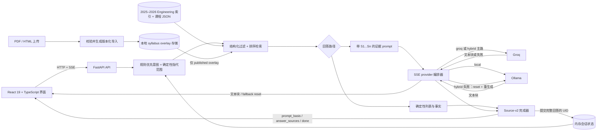

# Course Advisor

[English](README.md)

面向 **Columbia Engineering 2025–2026 Bulletin** 的 evidence-grounded、可自托管课程顾问。

Course Advisor 将结构化课程检索、确定性事实渲染和可选大模型整合在一个 React 19 + TypeScript + FastAPI 应用中。每个完整回答都可检查：界面会区分“生成时考虑过的课程”和“最终回答实际引用的课程记录”。

> **范围说明：** 仓库内是 Columbia Engineering Bulletin 的静态快照，不是 Columbia 全校课程目录，不是实时选课/注册数据源，不是 Columbia 官方产品，也不能替代专业学术顾问。

## 项目亮点

- **先检索，后生成。** 规则优先的意图层先过滤、排序结构化字段，再只加载相关课程的完整记录。
- **能确定就不交给模型猜。** 课程列表、时间、学分、教师、人数、先修课，以及部分比较和适合度问题，由后端直接依据结构化证据生成。
- **Answer source v2。** 每个 SSE 回答将 `prompt_basis`（提供给生成过程的候选证据）与 `answer_sources`（完整回答实际使用的记录）分开。服务端和前端都会校验 UID 映射、引用角色、顺序及兼容字段。
- **以 UID 绑定多轮指代。** “这两门课”一类带数量的追问会绑定到上一轮完整回答实际引用的精确 UID；独立的结果范围和当前课程状态继续支持序数及单数追问。
- **Groq → Ollama reset-and-replace。** Hybrid 模式先用 Groq。如果 Groq 已输出部分文本后失败，服务端会发送 SSE reset，清空文本和来源状态，再让 Ollama 基于相同 prompt/history 从头生成；两家输出绝不拼接。
- **只附加、不改 seed 的课程文件导入。** PDF、HTML、HTM 文件可为已有课程身份添加经过校验、带版本的 overlay；只有 `published` overlay 进入检索，提交到仓库的课程 seed 保持不变。
- **流式多语言界面。** React 19、TypeScript、Vite 6、FastAPI 与 SSE 支持中、英、西、法语交互。

## 架构



## 快速开始

### 前置条件

- Python 3.11+
- Node.js 20+ 与 npm
- 云端或 hybrid 模式需要 Groq API key
- 本地或 hybrid 模式需要 [Ollama](https://ollama.com/)

先在仓库根目录安装本地依赖：

```bash
python3 -m venv .venv
.venv/bin/python -m pip install --upgrade pip
.venv/bin/python -m pip install -r backend/requirements.txt

cd frontend
npm ci
cd ..
```

虚拟环境和 `node_modules/` 都是本地产物，Git 已有意忽略；仓库并未提交 venv。

### 方案一：Groq 云端

在一个终端启动后端。Key 只应进入后端进程环境或密钥管理器，绝不能写入 `frontend/.env` 或任何 `VITE_` 变量。

```bash
cd backend
export GROQ_API_KEY="replace-with-your-key"
INFERENCE_MODE=groq ../.venv/bin/python -m uvicorn server:app \
  --host 127.0.0.1 --port 8000
```

### 方案二：本地 Ollama

回答模型和用于稳定 JSON 意图抽取的模型都需要提前准备：

```bash
ollama pull qwen3-nothink:latest
ollama pull qwen2.5:7b

cd backend
GROQ_API_KEY= INFERENCE_MODE=local ../.venv/bin/python -m uvicorn server:app \
  --host 127.0.0.1 --port 8000
```

显式清空继承到当前 shell 的 `GROQ_API_KEY`，可以避免 local 启动/健康检查路径探测云端 key。

### 方案三：Hybrid Groq → Ollama

先拉取上面的两个 Ollama 模型，再同时配置两种 provider：

```bash
cd backend
export GROQ_API_KEY="replace-with-your-key"
INFERENCE_MODE=hybrid ../.venv/bin/python -m uvicorn server:app \
  --host 127.0.0.1 --port 8000
```

Hybrid 会优先请求 Groq，只有真实请求失败时才懒触发 Ollama fallback。

### 启动前端

在另一个终端执行：

```bash
cd frontend
npm run dev
```

打开 `http://localhost:3000`。Vite 默认将 `/api` 代理到 `http://localhost:8000`。前端单独配置见 [`frontend/README.md`](frontend/README.md)。

### 网络与 API 安全

后端与 Vite 开发服务器都应绑定 `127.0.0.1`。为兼容本机使用，loopback
请求默认无需 token；对非 loopback 客户端，所有高成本或会写入状态的 POST
接口（chat、两种 import、export）都会 fail closed，除非后端设置了
`COURSE_ADVISOR_API_TOKEN`，且请求通过 `Authorization: Bearer ...` 提交。
token 使用恒定时间比较，缺失 token 不会写入日志。

共享部署应在生产级反向代理完成用户认证，把
`COURSE_ADVISOR_API_TOKEN` 只放在后端/代理的密钥存储中，并设置
`COURSE_ADVISOR_ALLOW_LOOPBACK_WITHOUT_AUTH=0`，避免本机代理继承开发绕过。
不要对外暴露 Vite 开发服务器，也不要把 token 放进任何 `VITE_*` 变量；
所有 `VITE_*` 值都会进入公开的浏览器代码。

受保护接口还会在解析前限制原始 body，按客户端限速，并限制覆盖完整请求
生命周期的并发数。运维可通过有界的 `API_*`、`MAX_PDF_*` 和
`SYLLABUS_STORE_MAX_*` 环境变量调整默认值。

## 数据与证据模型

仓库内的正式基线包含：

- **1,021** 条课程记录
- **1,021** 个唯一课程 UID
- **874** 个唯一课程代码
- Bulletin 年份 **2025–2026**

`data/courses_flat/` 保存完整记录；`courses_flat_index.json` 和 `courses_enriched_index.json` 用于身份查找及检索。同一个课程代码可能对应不同 UID，因此涉及身份的流程使用 `course_uid`，而不只看课程代码。

Source-v2 SSE 事件有意提供两种不同视图：

- `prompt_basis`：提供给确定性渲染或模型生成的全部课程记录；
- `answer_sources`：最终完整回答可以验证为实际引用的有序子集。

只有生成成功后才会确认 sources；只有 stream 到达最终 `done` 后，系统才提交对话历史与 actual-answer UID。

缺失课程证据统一视为 **unknown**。尤其是：先修课字段缺失不等于“没有先修课”；除非来源明确说明，否则回答会表述为“未列出先修课信息”。

## 文件导入

界面和 API 支持不超过 25 MB 的 PDF、HTML、HTM 文件。multipart 解析前即限制请求字节，并同时硬限制 PDF 页数、提取字符、解析时间、section 数量和持久化 overlay 容量。上传内容按不可信输入处理，并且必须匹配已有 seed 课程。质量门禁会返回三种结果：

- `published`：保存版本化 overlay，并进入检索；
- `review`：保留候选，但不进入当前检索视图；
- `rejected`：不发布任何 overlay。

运行时上传内容保存在已忽略的 `data/syllabus_store/` 中，不会改写 `data/courses_flat/` 或两个正式索引。

## API

| Endpoint | 用途 |
| --- | --- |
| `POST /api/chat` | 包含 provider、fallback、sources、done 事件的 SSE 对话流 |
| `POST /api/import` | PDF/HTML syllabus 上传 |
| `POST /api/import/manual` | 经过校验的手动 syllabus overlay |
| `POST /api/export` | 导出 Markdown 或 JSON 对话 |
| `GET /api/health` | Provider 与课程数据就绪状态 |
| `GET /api/courses/stats` | 课程库概要字段 |

## 验证

标准测试套件可离线、确定性运行。后端测试包含真实 loopback Uvicorn + HTTP/SSE 边界，但使用 fake provider，因此不需要 Groq 或 Ollama。

```bash
(cd backend && ../.venv/bin/python -m pytest)
(cd frontend && npm run lint && npm test && npm run build)
.venv/bin/python -m pytest columbia_engineering_courses/tests
git diff --check
```

真实模型 smoke test 必须显式开启；只要 health degraded、传输失败、出现 SSE error、缺少 sources 或最终事件不是 Ollama `done`，脚本就会失败：

```bash
RUN_OLLAMA_INTEGRATION=1 backend/tests/test_track_c_integration_safe.sh
```

验证基线（**2026-08-11**，Python 3.13.9、Node.js 25.6.1）：

- 后端：**420 passed**，其中包括 3 个真实 loopback HTTP/SSE 测试；
- 前端：**11 个文件、102 个测试通过**，typecheck 与 production build 同时成功；
- 采集器/离线修复：**17 passed**，测试未访问网络。

采集与离线修复流程见 [`columbia_engineering_courses/README.md`](columbia_engineering_courses/README.md)。

## 限制与免责声明

- 课程库是版本化快照，不是实时注册、余位、教师或课表数据。
- 数据只覆盖 Columbia Engineering 2025–2026 Bulletin，不是 Columbia 全校课程目录。
- 来源中缺失的字段仍是 unknown，必须到官方系统确认。
- LLM 输出具有概率性。结构化检索和来源校验提升了可审计性，但不保证回答一定正确。
- 会话保存在进程内存中，并受轮次、字符数和 session 数量限制；后端重启后会丢失。
- Groq 和 hybrid 模式会把模型 prompt 发送到 Groq；需要模型流量留在本机时请使用 local 模式。
- 本项目为独立、非官方项目。所有学术决定都应向官方 Bulletin、registrar 和合格的学术顾问确认。

## 仓库结构

```text
backend/                       FastAPI API、检索、provider、导入与测试
frontend/                      React 19 + TypeScript 客户端
data/                          版本化 2025–2026 Engineering 课程 seed
columbia_engineering_courses/  采集器、离线修复工具与离线测试
```
